# Android OpenGLES 2.0 从零开始学习的程序

#### 学习如何绘制简单图形、色彩、三维体、投影、纹理，及相机Camera和Camera2的预览、拍照、视频录制、视频滤镜、音视频合成，视频播放特效相关的技术。

|  表头   | 表头  | 表头  | 表头  |
|  ----  | ----  |----  |----  |
| 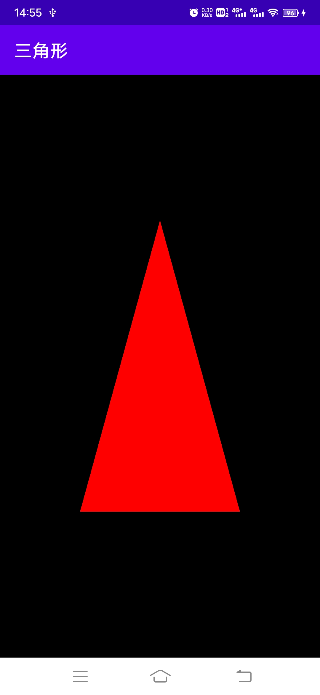  | 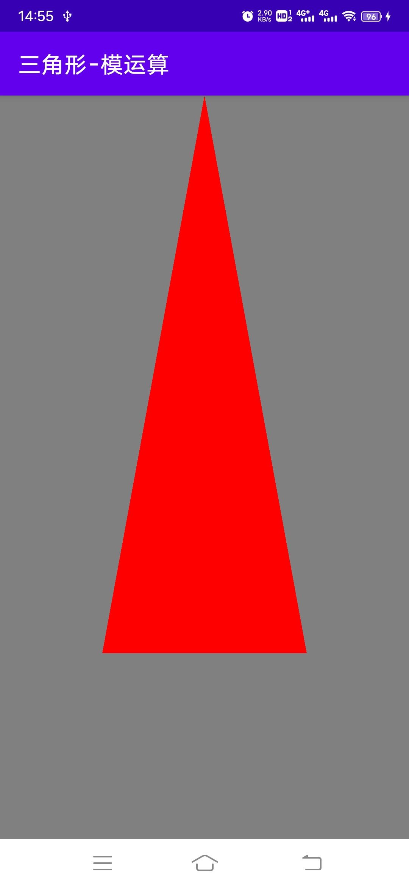 | 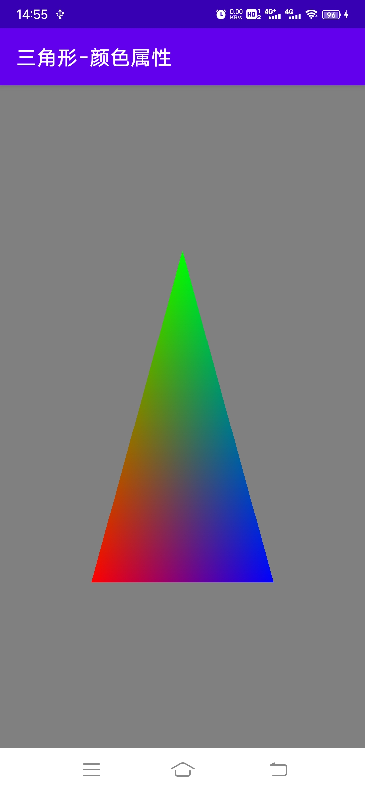 | 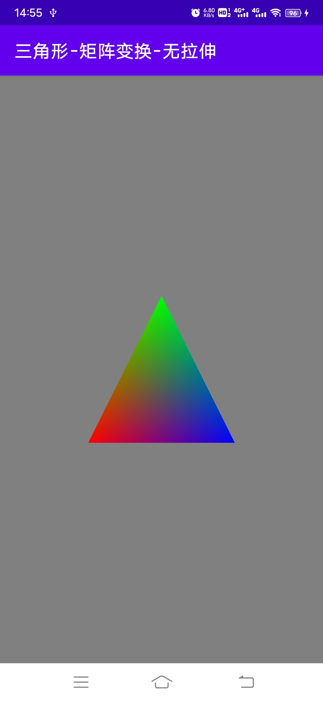 |
| 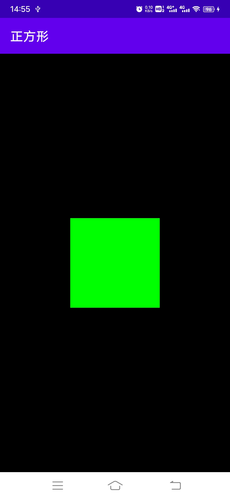  | 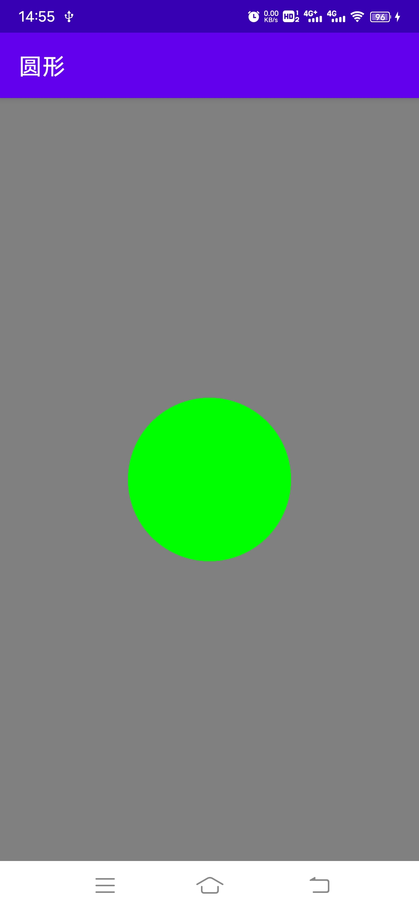 | 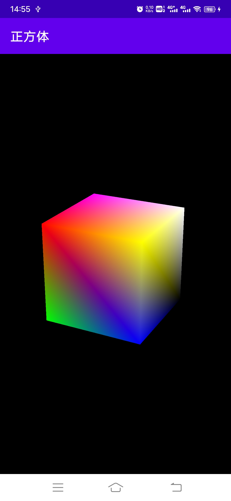 | 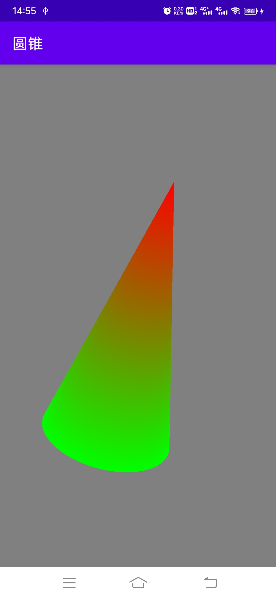 |
| 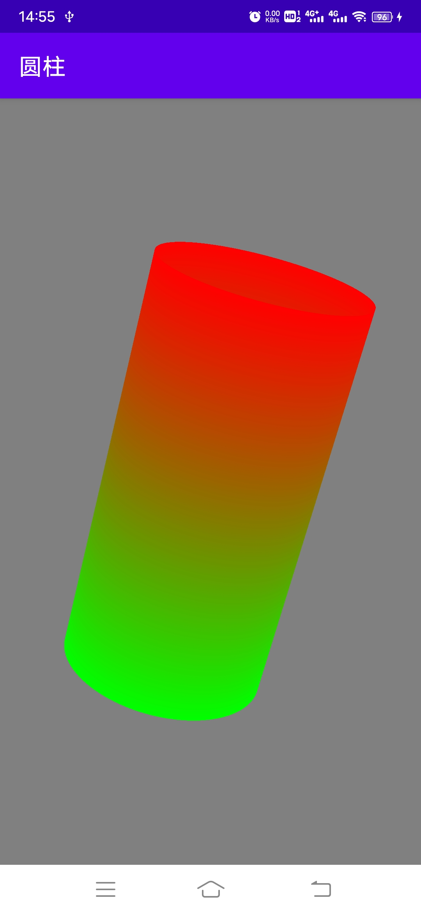  | 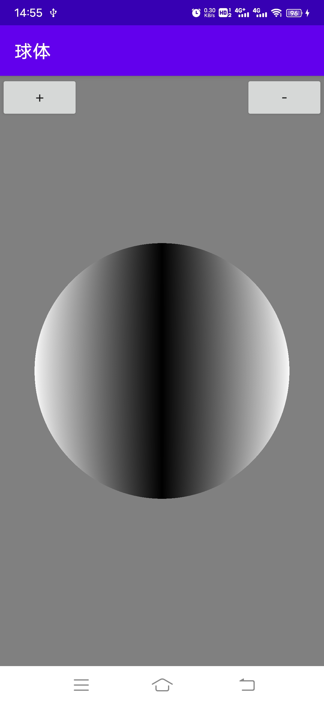 | 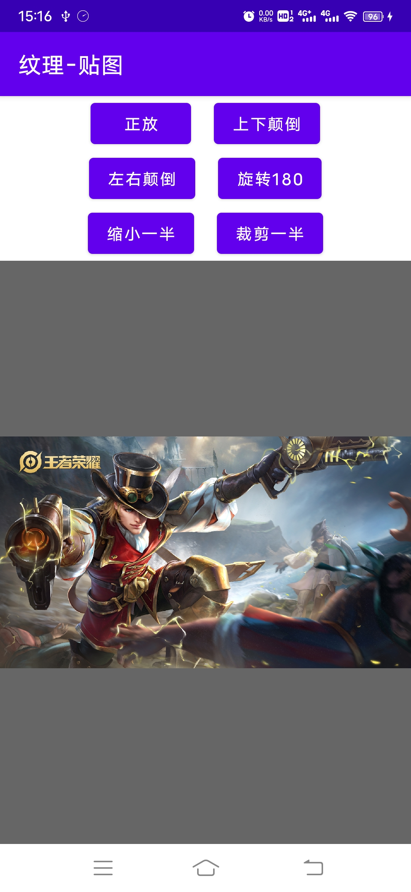 | 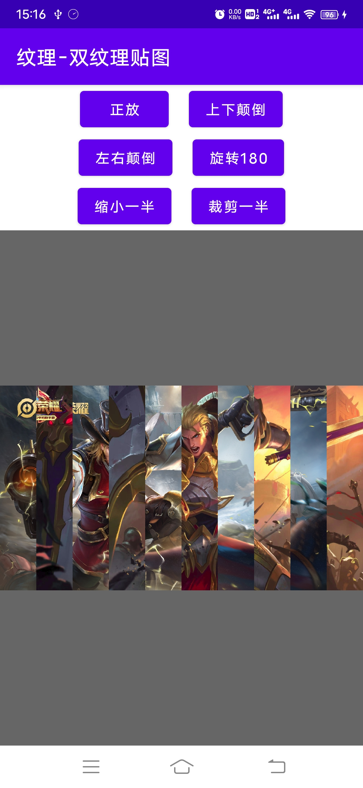 |
| 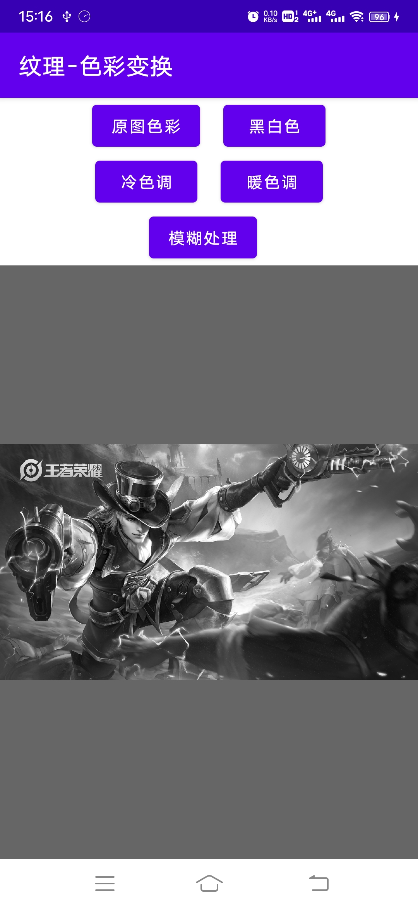  | 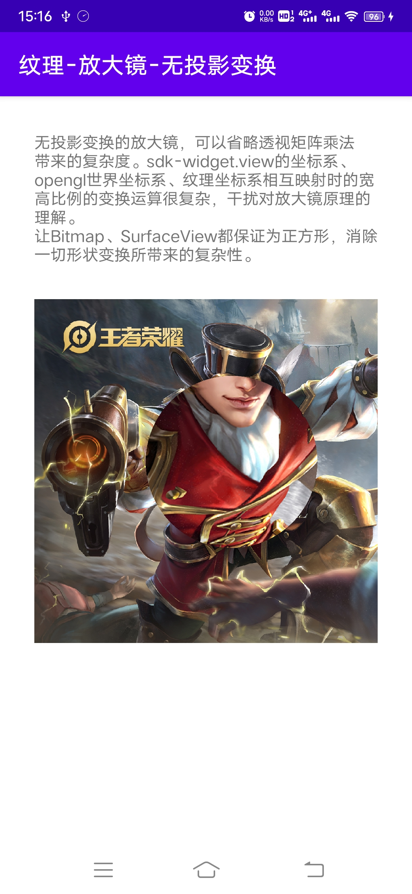 | 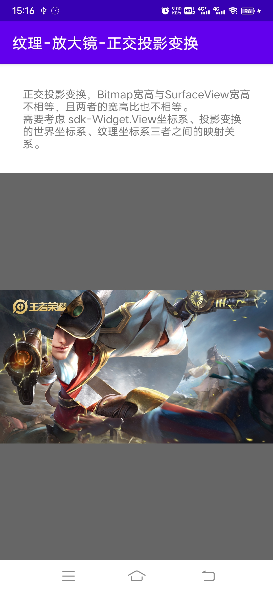 | 单元格 |

|  表头   | 表头  | 表头  | 表头  |
|  ----  | ----  |----  |----  |
|   |  |  |  |
|   |  |  |  |
|   |  |  |  |

